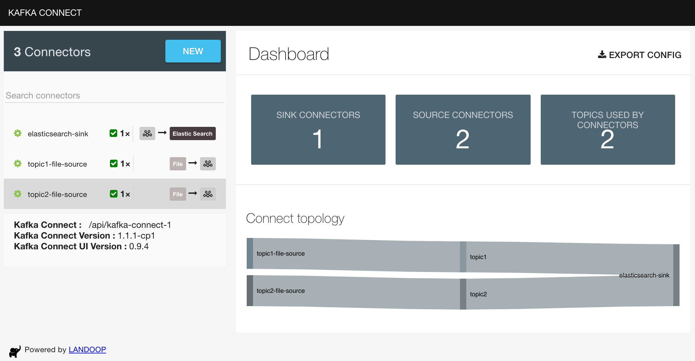
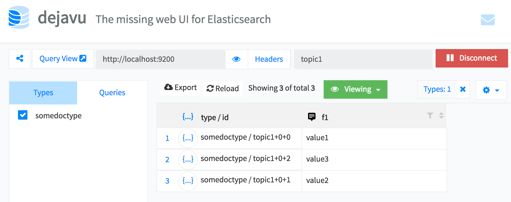

# ETL file data to ElasticSearch

## Overview



## Run the Pipeline

### Start Services

```bash
docker-compose up -d
```

After services fully start, visit

- [Kafka topics UI](http://localhost:8000)
- [Kafka Connect UI](http://localhost:8001)

### Create Connectors

- File source connectors for `topic1` and `topic2`

```bash
curl -X POST http://localhost:8083/connectors \
    -H 'Content-Type:application/json' \
    -H 'Accept:application/json' \
    -d @connectors/filesource-topic1.json
```

```bash
curl -X POST http://localhost:8083/connectors \
    -H 'Content-Type:application/json' \
    -H 'Accept:application/json' \
    -d @connectors/filesource-topic2.json
```

- ElasticSearch sink connector

```bash
curl -X POST http://localhost:8083/connectors \
    -H 'Content-Type:application/json' \
    -H 'Accept:application/json' \
    -d @connectors/elasticsearchsink.json
```

### Append data to file

```text
{"timestamp":1528591539001,"event":"login"}
{"timestamp":1528592539001,"event":"logout"}
{"timestamp":1528593539001,"event":"login"}
{"timestamp":1528594539001,"event":"logout"}
```

### View Data in ElasticSearch

- Open [ElasticSearch UI](http://localhost:1358)
- Configure [ElasticSearch host](http://localhost:9200) and index (e.g., `topic1`) to view data
- Sample data should have been populated in the UI



## References

- [Apache Kafka Documentation - Connect](https://kafka.apache.org/documentation/#connect)
- [Confluent Docker Configuration](https://docs.confluent.io/current/installation/docker/docs/configuration.html)
- [Confluent Kafka Connect REST API](https://docs.confluent.io/current/connect/references/restapi.html)
- [Confluent ElasticSearch Connector](https://docs.confluent.io/current/connect/connect-elasticsearch/docs/elasticsearch_connector.html)
